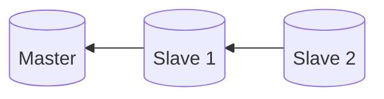

# Simple GTID-based Replication

This setup consists of 1 master and 1 slave which replicates from master and 1 slave
which replicates from the other slave. Replications are done using the
GTID mode.



## How to Configure

1. Scaffold the infrastructure
   ```bash
   docker compose up -d
   ```
2. Connect to `master` at `root:root_password@localhost:3306/database1`
3. Connect to `slave1` at `root:root_password@localhost:3307/database1`
4. Connect to `slave2` at `root:root_password@localhost:3308/database1`

## Testing

Try running the following SQL script on `master`:

```sql
CREATE TABLE database1.testing (
	uid INT NOT NULL
);

INSERT INTO database1.testing
VALUES
	(1),
	(2),
	(3);
```

In `slave1` and `slave2` inside the `database1` database should appear a new table named `testing`
which has a single column named uid. If you inspect the data, there should be 3 entries
coming from the above SQL command.
