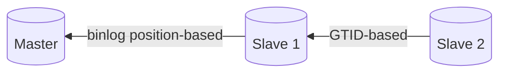

# Simple binlog-based Replication

This setup consists of 1 master, 1 slave which replicates from master using the old
binlog position-based method, and 1 more slave which replicates from the other slave
using the newer GTID-based method.



## How to Configure

1. Scaffold the infrastructure
   ```bash
   docker compose up -d
   ```
2. Connect to `master` at `root:root_password@localhost:3306/database1`
3. Get the binlog name and position by running:
   ```sql
   SHOW BINARY LOG STATUS;
   ```
4. Connect to `slave1` at `root:root_password@localhost:3307/database1`
5. Connect to master with the following command:
   ```sql
   CHANGE REPLICATION SOURCE TO
      ASSIGN_GTIDS_TO_ANONYMOUS_TRANSACTIONS = LOCAL,
      SOURCE_HOST = 'master',
      SOURCE_USER = 'slave',
      SOURCE_PASSWORD = 'password',
      SOURCE_LOG_FILE = '<binlog name>',
      SOURCE_LOG_POS = <binlog position>;
   ```
6. Run:
   ```sql
   START REPLICA
   ```
7. Connect to `slave2` at `root:root_password@localhost:3307/database1`

## Testing

Try running the following SQL script on `master`:

```sql
CREATE TABLE database1.testing (
	uid INT NOT NULL
);

INSERT INTO database1.testing
VALUES
	(1),
	(2),
	(3);
```

In `slave1` and `slave2`'s `database1` database should appear a new table named `testing`
which has a single column named uid. If you inspect the data, there should be 3 entries
coming from the above SQL command.

Now try running the following SQL script on `slave1`:

```sql
CREATE TABLE database1.users (
	uid INT NOT NULL,
	full_name TEXT NOT NULL
);

INSERT INTO database1.users
VALUES
	(1, 'Verstappen'),
	(2, 'Messi'),
	(3, 'Khalid');
```

Now in `slave2`'s `database1` database should appear a new table named `users`
which contains 3 records coming from the above query. The same phenomena won't
occur on `master`.
