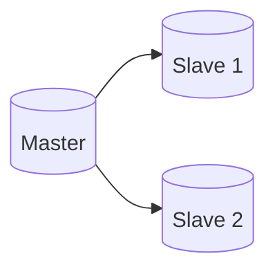

# Group Replication

This setup consists of 1 master and 2 slaves running on group replication mode.
If the master dies, one of the slaves will be automatically elected as a new master.



## How to Configure

1. Scaffold the infrastructure
   ```bash
   docker compose up -d
   ```
2. Connect to `master` at `root:root_password@localhost:3306/database1`
3. Bootstrap the group replication:
   ```sql
   CALL set_as_master;
   ```
5. Connect to `slave1` at `root:root_password@localhost:3307/database1`
6. Set it to join the replication group:
   ```sql
   CALL set_as_slave;
   ```
7. Connect to `slave2` at `root:root_password@localhost:3308/database1`
8. Set it to join the replication group:
   ```sql
   CALL set_as_slave;
   ```

## Testing

### Replication Testing
Try running the following SQL script on `master`:

```sql
CREATE TABLE database1.testing (
	uid INT NOT NULL
);

INSERT INTO database1.testing
VALUES
	(1),
	(2),
	(3);
```

In `slave1` and `slave2` inside the `database1` database should appear a new table named `testing`
which has a single column named uid. If you inspect the data, there should be 3 entries
coming from the above SQL command.

### Automatic Master Election Testing
Try stopping the master container and then run the following query:
```sql
SELECT * FROM performance_schema.replication_group_members;
```

You should see that one of the slaves automatically gets promoted as a new master.
