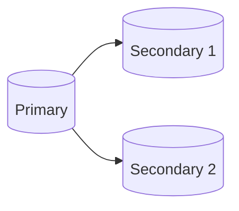

# Group Replication

This setup consists of 1 primary and 2 secondaries running on group replication mode.
If the primary dies, one of the secondaries will be automatically elected as a new primary.



## How to Configure

1. Scaffold the infrastructure
   ```bash
   docker compose up -d
   ```
2. Connect to `primary` at `root:root_password@localhost:3306/database1`
3. Bootstrap the group replication:
   ```sql
   CALL set_as_primary;
   ```
4. Connect to `secondary1` at `root:root_password@localhost:3307/database1`
5. Set it to join the replication group:
   ```sql
   CALL set_as_secondary;
   ```
6. Connect to `secondary2` at `root:root_password@localhost:3308/database1`
7. Set it to join the replication group:
   ```sql
   CALL set_as_secondary;
   ```

## Testing

### Replication Testing

Try running the following SQL script on `primary`:

```sql
CREATE TABLE database1.testing (
	uid INT NOT NULL
);

INSERT INTO database1.testing
VALUES
	(1),
	(2),
	(3);
```

In `secondary1` and `secondary2` inside the `database1` database should appear a new table named `testing`
which has a single column named uid. If you inspect the data, there should be 3 entries
coming from the above SQL command.

### Automatic Primary Election Testing

Try stopping the primary container and then run the following query:

```sql
SELECT * FROM performance_schema.replication_group_members;
```

You should see that one of the secondaries automatically gets promoted as a new primary.
