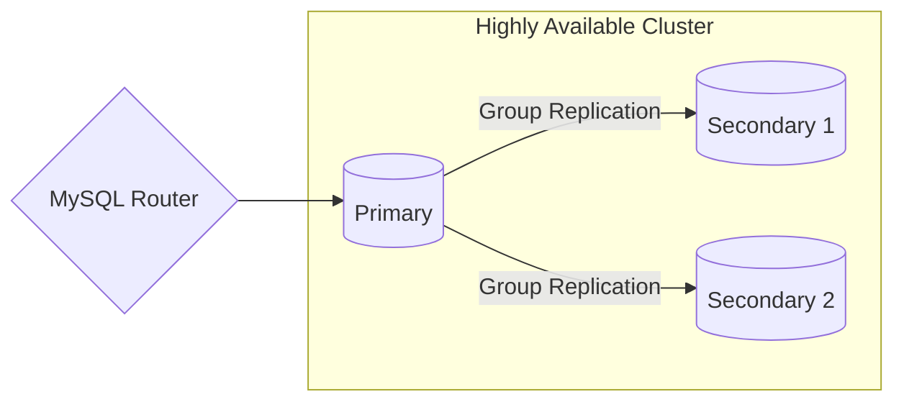

# Group Replication

This setup consists of 1 primary and 2 secondaries running on group replication mode.
If the primary dies, one of the secondaries will automatically get elected as the new primary.



## How to Configure

1. Scaffold the infrastructure
   ```bash
   docker compose up -d
   ```
2. Connect to the router at `root:root_password@localhost:6446/database1`

## Testing

### Replication Testing

Try running the following SQL script using the connection established through the router:

```sql
CREATE TABLE database1.testing (
	uid INT NOT NULL
);

INSERT INTO database1.testing
VALUES
	(1),
	(2),
	(3);
```

In `secondary1` and `secondary2` inside the `database1` database should appear a new table named `testing`
which has a single column named uid. If you inspect the data, there should be 3 entries
coming from the above SQL command.

### Automatic Primary Election Testing

Try running the following command through the router connection:

```sql
SELECT * FROM performance_schema.replication_group_members;
```

You should see an instance with `MEMBER_HOST` is set as the primary.
Now try stopping the primary container, invalidate the connection to the router, then try running the command again.
You should see that one of the secondaries automatically gets promoted as a new primary.
